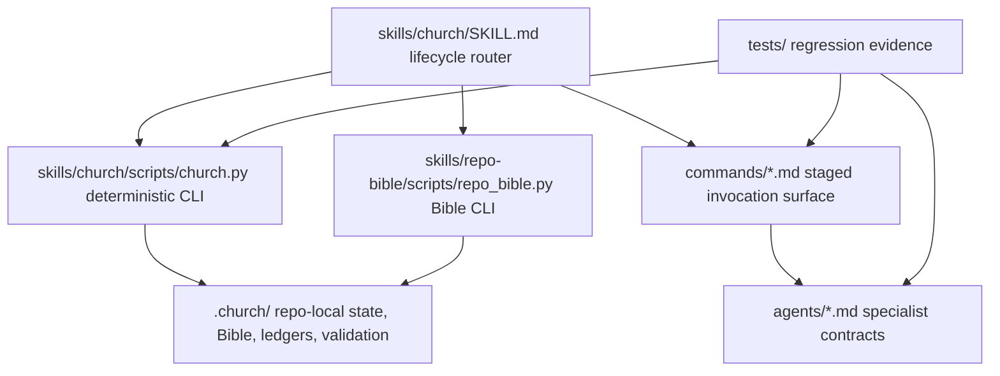

# Architecture Map

## Whole-System Map

## Component Matrix

| Component | Status | Evidence | Phase | Requirement IDs | Remediation |
|---|---|---|---|---|---|
| Lifecycle CLI | Existing, validated | `skills/church/scripts/church.py` | P01 | SR-01, SR-02 | Maintain full self-lifecycle regression coverage. |
| Repo Bible CLI | Existing, validated | `skills/repo-bible/scripts/repo_bible.py` | P01 | SR-03 | Keep deterministic reports regenerated by `church lifecycle prove`. |
| Staged commands | Existing, validated | `commands/*.md` | P01 | SR-04 | Keep common gate record required in every command. |
| Specialist profiles | Existing, validated | `agents/*.md` | P01 | SR-04 | Keep standard report footer required in every profile. |
| Meta-Bible artifacts | Existing, validated | `.church/bible/*.md` | P01 | SR-01, SR-03 | Keep packet validation clean before ship. |
| Self-lifecycle proof | Existing, validated | `tests/test_church_meta_lifecycle.py` | P01 | SR-01, SR-05 | Keep proof command idempotent and evidence-backed. |

## Interfaces

| Interface | Contract | Failure mode | Guard |
|---|---|---|---|
| `church lifecycle advance` | Records workflow, outcome, evidence, and artifacts. | False `PASS` with no evidence. | `lifecycle_quality_check` plus meta-lifecycle test. |
| `church ledger check` | Blocks unresolved or proofless closure items. | `satisfied` without proof. | `ledger_item_quality_issues`. |
| `repo-bible validate` | Reports markdown, links, IDs, required terms, and placeholders. | Bible placeholders survive into planning. | Placeholder warnings and validation report. |
| `npx skills add ./ --list` | Install surface lists public skills. | Broken package install or namespace drift. | Ship-gate smoke check. |
