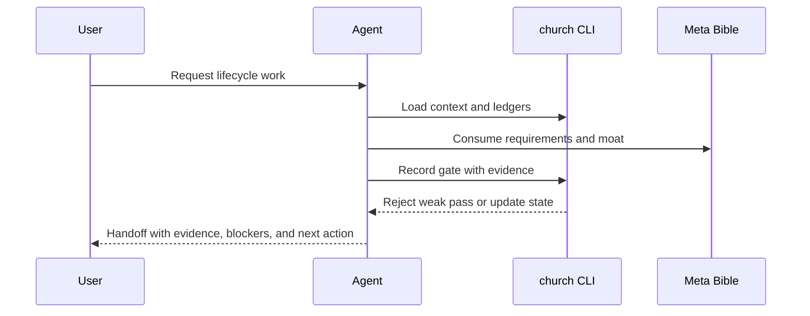

# UX Workflows and Must-Pass Cases

## Non-Negotiables

- A new operator can start with `church:gather`, see the active gate, and know the next command.
- A passing gate cannot be recorded without evidence.
- A future agent can resume from `.church/state.json`, context output, ledgers, and handoff without rereading the whole repo.
- A ship reviewer can see tests, risk, rollback, Bible drift, and install-surface proof in one report.

## Must-Pass Cases

| ID | Actor | Workflow | Expected outcome | Requirement IDs | Evidence |
|---|---|---|---|---|---|
| UX-01 | Agent/operator | Run `church init --scaffold-bible` on this repo. | `.church/state.json`, moat, and Bible scaffold exist. | SR-01 | `.church/state.json`, `.church/bible/` |
| UX-02 | Agent/operator | Attempt weak `moat/PASS` with empty moat. | Command fails and names missing evidence/score. | SR-02 | `tests/test_church_cli.py` |
| UX-03 | Agent/operator | Run full lifecycle from moat through refresh. | Active workflow becomes `refresh` with `PASS`. | SR-01 | `tests/test_church_meta_lifecycle.py` |
| UX-04 | Reviewer | Audit command/agent output contracts. | Common gate record and standard footer are present. | SR-04 | `tests/test_church_plugin_assets.py` |
| UX-05 | Shipper | Validate package and install surface. | Validator, tests, and `npx skills add ./ --list` pass. | SR-05 | `.church/validation/meta-ship-gate.md` |

## Journey Map

