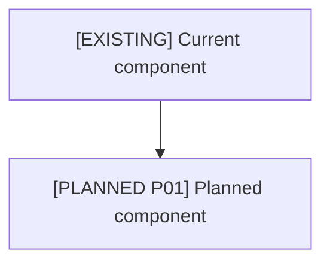

# Architecture Map

## Legend

| Marker | Meaning |
|---|---|
| `[EXISTING]` | Present now |
| `[PARTIAL]` | Present but incomplete or misaligned |
| `[PLANNED Pxx]` | Planned phase |
| `[EXTERNAL]` | External platform/source |
| `[RISK]` | Needs remediation |

## Whole-System Map

## Component Matrix

| Component | Status | Evidence | Phase | Requirement IDs | Remediation |
|---|---|---|---|---|---|
| [Component] | [Status] | [File/source] | [Phase] | [IDs] | [Action] |

