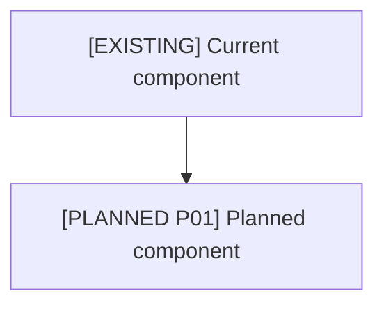

# Architecture Map

## Legend

| Marker | Meaning |
|---|---|
| `[EXISTING]` | Present now |
| `[PARTIAL]` | Present but incomplete or misaligned |
| `[PLANNED Pxx]` | Planned phase |
| `[EXTERNAL]` | External platform/source |
| `[RISK]` | Needs remediation |

## Whole-System Map

## Component Matrix

| Component | Status | Evidence | Phase | Requirement IDs | Remediation |
|---|---|---|---|---|---|
| [Component] | [Status] | [File/source] | [Phase] | [IDs] | [Action] |

Minimum quality:

- Replace every bracketed placeholder before treating this as architecture evidence.
- Evidence must point to files, diagrams, APIs, logs, or source docs; do not use unsupported architectural claims.
- Components with `[PARTIAL]` or `[RISK]` need an owner, remediation action, and recheck command in the gap ledger.
- Every planned component must cite a roadmap phase and requirement ID.

Example row:

| Component | Status | Evidence | Phase | Requirement IDs | Remediation |
|---|---|---|---|---|---|
| Import audit reporter | `[PLANNED P01]` | `SPEC-P01`, `tests/fixtures/import-cases.json` | P01 | S-02 | Add reporter, run audit, record `.church/validation/import-audit.md` |
