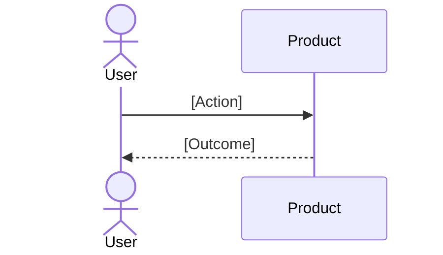

# UX Workflows and Must-Pass Cases

## Non-Negotiables

- [Rule]
- [Rule]

## Must-Pass Cases

| ID | If user/system does X | Then Y must Z | Failure/recovery | Verification |
|---|---|---|---|---|
| UX-01 | [Trigger] | [Expected behavior] | [Fallback] | [Test/check] |

## Journey Map

